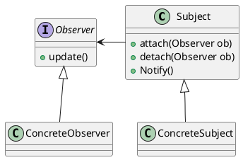

## 观察者模式
又称发布-订阅模式（Publish-Subscribe：Pub/Sub）  
定义对象间一种一对多的依赖关系，使得每当一个对象改变状态，则所有依赖于它的对象都会得到通知并被自动更新。  

### 定义  
1. Subject: 被观察者，它必须能够动态地增加、取消观察者。职责：管理观察者并通知观察者。
2. Observer：观察者，接到通知后，处理接收到的信息。
3. ConcreteSubject：定义被观察者自己的业务逻辑，同时定义对哪些事件进行通知。
4. ConcreteObserver：每个观察者在接收到消息后的处理反应是不同的。

### 优点  
1. 观察者和被观察者之间是抽象耦合
2. 建立一套触发机制

### 缺点
1. 效率问题，一个观察者失败，会影响整体的执行效率。

### 注意事项
1. 广播链的问题  
消息传播问题。
2. 异步处理问题  
涉及线程安全，队列问题。

